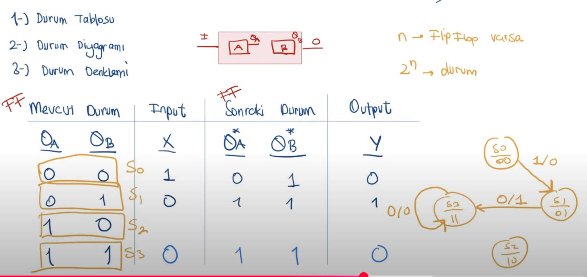
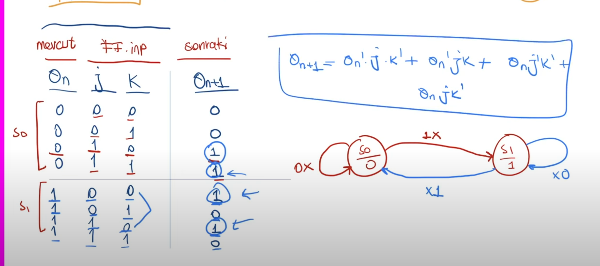

**Notlar**
1-Senkron bir devre yapmak çok önemli.
2-Senkron sıralı devreler combinational ve sequential bloklardan oluşur.

-----
**Finite State Machine**

**FSM DEVRE ANALİZİ**

-----
RTL: Register Transfer Level, işin fiziksel tasarım kısmına kadar olan sentez dahil olan kısma kadar RTL design yada frontend deniyor.
-----
**State Diagram**
1- State Table
2- State Diagram
3- State Function
State Diagramlar bize input outpu ve flip-flopların bağlanatılarını verecek şimdi;

1-Mevcut Durum(ff) -> Input -> Sonraki Durum(ff) -> Output 

-----
**Design of a clocked sequential citcuit**

